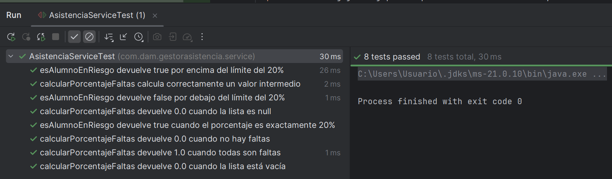

# Documentación del Proyecto - GestorAsistencia

Esta carpeta contiene toda la documentación técnica del proyecto para el apartado **3.4 - Documentación**.

---

## Contenido

### 1. JavaDoc (Pendiente de generar)

El JavaDoc debe ser generado usando Maven y copiado a esta carpeta.

**Comando para generar:**
```powershell
mvn javadoc:javadoc
```

**Ubicación después de generar:**
- El JavaDoc se genera en: `target\site\apidocs\`

**Copiar a /docs:**
```powershell
Copy-Item -Recurse -Force "target\site\apidocs\*" "docs\"
```

Una vez copiado, esta carpeta debe contener:
- `index.html` - Página principal del JavaDoc
- Todas las subcarpetas con la documentación de las clases

**Verificación:**
- Abrir `docs\index.html` en un navegador
- Verificar que se puede navegar por toda la documentación de las clases

---

### 2. Informe de Pruebas

📄 **INFORME_PRUEBAS.md**

Documento completo que describe:
- Los algoritmos probados (`calcularPorcentajeFaltas`, `esAlumnoEnRiesgo`)
- Suite de 8 tests unitarios con JUnit 5
- Resultados de la ejecución de los tests

**⚠️ ACCIÓN REQUERIDA:**
Debes añadir una captura de pantalla de los tests ejecutados en tu IDE.

**Pasos:**
1. Ejecutar los tests en tu IDE (IntelliJ IDEA, Eclipse, VS Code):
   - Click derecho en `AsistenciaServiceTest.java`
   - Run 'AsistenciaServiceTest' (o JUnit Test)

2. Capturar la ventana de resultados mostrando:
   - 8 tests en verde (PASSED)
   - Tiempo de ejecución

3. Guardar la captura como: `docs/test-results-screenshot.png`

4. (Opcional) Añadir referencia en `INFORME_PRUEBAS.md`:
   ```markdown
   
   ```

---

## Estructura Final Esperada

```
/docs/
├── README.md                      ← Este archivo
├── INFORME_PRUEBAS.md             ← Informe de pruebas (completo)
├── test-results-screenshot.png    ← Captura de tests (PENDIENTE)
├── index.html                     ← JavaDoc principal (PENDIENTE)
├── allclasses-index.html          ← JavaDoc (PENDIENTE)
├── allpackages-index.html         ← JavaDoc (PENDIENTE)
├── com/                           ← JavaDoc (PENDIENTE)
│   └── dam/
│       └── gestorasistencia/
│           ├── model/
│           ├── service/
│           ├── controller/
│           ├── repository/
│           └── config/
└── [otros archivos JavaDoc...]
```

---

## Requisitos del Apartado 3.4

Según el PDF del proyecto:

✅ **JavaDoc completo:**
- Carpeta completa generada por javadoc
- Debe contener index.html para navegar por la documentación técnica

✅ **Documentación de Pruebas:**
- Informe indicando qué algoritmo se ha probado
- Captura de pantalla de los resultados de los tests (Test passed)

---

## Verificación Final

Antes de entregar, verifica:

- [ ] El JavaDoc está generado y copiado a `/docs`
- [ ] El archivo `index.html` abre correctamente en un navegador
- [ ] El informe `INFORME_PRUEBAS.md` está completo
- [ ] La captura de pantalla `test-results-screenshot.png` existe
- [ ] La captura muestra claramente los 8 tests en verde

---

**Nota:** Una vez completados estos pasos, el apartado 3.4 (Documentación) estará finalizado.
